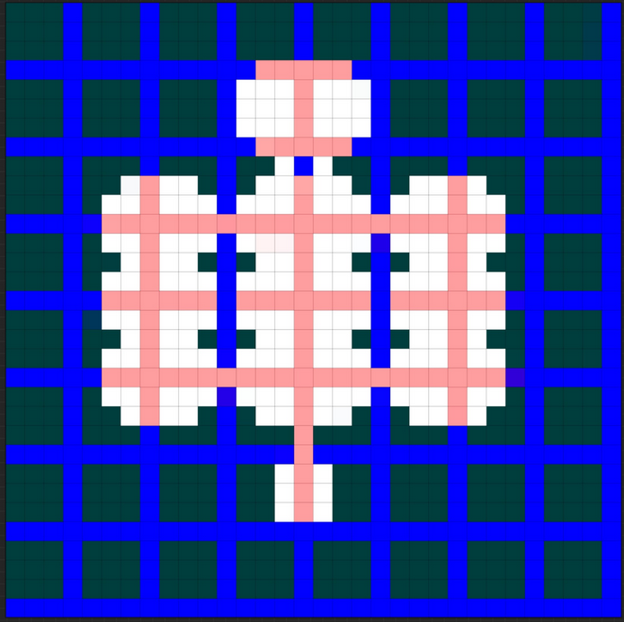

# map1 layout design
## about
* this is just for converting the map from image to bits

## image
* 

## raw bit values

```
1 1 1 1  1 1 1 1   1 1 1 1  1 1 1 1   1 1 1 1  1 1 1 1   1 1 1 1  1 1 1 1   
1 1 1 1  1 1 1 1   1 1 1 1  1 1 1 1   1 1 1 1  1 1 1 1   1 1 1 1  1 1 1 1   
1 1 1 1  1 1 1 1   1 1 1 1  1 1 1 1   1 1 1 1  1 1 1 1   1 1 1 1  1 1 1 1   
1 1 1 1  1 1 1 1   1 1 1 1  1 0 0 0   0 0 1 1  1 1 1 1   1 1 1 1  1 1 1 1   
                                                                            
1 1 1 1  1 1 1 1   1 1 1 1  0 0 0 0   0 0 0 1  1 1 1 1   1 1 1 1  1 1 1 1   
1 1 1 1  1 1 1 1   1 1 1 1  0 0 0 0   0 0 0 1  1 1 1 1   1 1 1 1  1 1 1 1   
1 1 1 1  1 1 1 1   1 1 1 1  0 0 0 0   0 0 0 1  1 1 1 1   1 1 1 1  1 1 1 1   
1 1 1 1  1 1 1 1   1 1 1 1  1 0 0 0   0 0 1 1  1 1 1 1   1 1 1 1  1 1 1 1   
                                                                            
1 1 1 1  1 1 1 1   1 1 1 1  1 1 0 1   0 1 1 1  1 1 1 1   1 1 1 1  1 1 1 1   
1 1 1 1  1 1 0 0   0 0 1 1  1 0 0 0   0 0 1 1  1 0 0 0   0 1 1 1  1 1 1 1   
1 1 1 1  1 0 0 0   0 0 0 1  0 0 0 0   0 0 0 1  0 0 0 0   0 0 1 1  1 1 1 1   
1 1 1 1  1 0 0 0   0 0 0 0  0 0 0 0   0 0 0 0  0 0 0 0   0 0 1 1  1 1 1 1   
                                                                            
1 1 1 1  1 0 0 0   0 0 0 1  0 0 0 0   0 0 0 1  0 0 0 0   0 0 1 1  1 1 1 1   
1 1 1 1  1 1 0 0   0 0 1 1  1 0 0 0   0 0 1 1  1 0 0 0   0 1 1 1  1 1 1 1   
1 1 1 1  1 0 0 0   0 0 0 1  0 0 0 0   0 0 0 1  0 0 0 0   0 0 1 1  1 1 1 1   
1 1 1 1  1 0 0 0   0 0 0 1  0 0 0 0   0 0 0 1  0 0 0 0   0 0 1 1  1 1 1 1   
                                                                            
1 1 1 1  1 0 0 0   0 0 0 1  0 0 0 0   0 0 0 1  0 0 0 0   0 0 1 1  1 1 1 1   
1 1 1 1  1 1 0 0   0 0 1 1  1 0 0 0   0 0 1 1  1 0 0 0   0 1 1 1  1 1 1 1   
1 1 1 1  1 0 0 0   0 0 0 1  0 0 0 0   0 0 0 1  0 0 0 0   0 0 1 1  1 1 1 1   
1 1 1 1  1 0 0 0   0 0 0 0  0 0 0 0   0 0 0 0  0 0 0 0   0 0 1 1  1 1 1 1   
                                                                            
1 1 1 1  1 0 0 0   0 0 0 1  0 0 0 0   0 0 0 1  0 0 0 0   0 0 1 1  1 1 1 1   
1 1 1 1  1 1 0 0   0 0 1 1  1 0 0 0   0 0 1 1  1 0 0 0   0 1 1 1  1 1 1 1   
1 1 1 1  1 1 1 1   1 1 1 1  1 1 1 0   1 1 1 1  1 1 1 1   1 1 1 1  1 1 1 1   
1 1 1 1  1 1 1 1   1 1 1 1  1 1 1 0   1 1 1 1  1 1 1 1   1 1 1 1  1 1 1 1   
                                                                            
1 1 1 1  1 1 1 1   1 1 1 1  1 1 0 0   0 1 1 1  1 1 1 1   1 1 1 1  1 1 1 1   
1 1 1 1  1 1 1 1   1 1 1 1  1 1 0 0   0 1 1 1  1 1 1 1   1 1 1 1  1 1 1 1   
1 1 1 1  1 1 1 1   1 1 1 1  1 1 0 0   0 1 1 1  1 1 1 1   1 1 1 1  1 1 1 1   
1 1 1 1  1 1 1 1   1 1 1 1  1 1 1 1   1 1 1 1  1 1 1 1   1 1 1 1  1 1 1 1   
                                                                            
1 1 1 1  1 1 1 1   1 1 1 1  1 1 1 1   1 1 1 1  1 1 1 1   1 1 1 1  1 1 1 1   
1 1 1 1  1 1 1 1   1 1 1 1  1 1 1 1   1 1 1 1  1 1 1 1   1 1 1 1  1 1 1 1   
1 1 1 1  1 1 1 1   1 1 1 1  1 1 1 1   1 1 1 1  1 1 1 1   1 1 1 1  1 1 1 1   
1 1 1 1  1 1 1 1   1 1 1 1  1 1 1 1   1 1 1 1  1 1 1 1   1 1 1 1  1 1 1 1   
```


## raw binary numbers

```
11111111111111111111111111111111
11111111111111111111111111111111
11111111111111111111111111111111
11111111111110000011111111111111
11111111111100000001111111111111
11111111111100000001111111111111
11111111111100000001111111111111
11111111111110000011111111111111
11111111111111010111111111111111
11111100001110000011100001111111
11111000000100000001000000111111
11111000000000000000000000111111
11111000000100000001000000111111
11111100001110000011100001111111
11111000000100000001000000111111
11111000000100000001000000111111
11111000000100000001000000111111
11111100001110000011100001111111
11111000000100000001000000111111
11111000000000000000000000111111
11111000000100000001000000111111
11111100001110000011100001111111
11111111111111101111111111111111
11111111111111101111111111111111
11111111111111000111111111111111
11111111111111000111111111111111
11111111111111000111111111111111
11111111111111111111111111111111
11111111111111111111111111111111
11111111111111111111111111111111
11111111111111111111111111111111
11111111111111111111111111111111
```

## log output converting

```c#
int lineIndex = 0;
Debug.Log("line["+(lineIndex++)+"]: "+(0b01111111111111111111111111111111) );
Debug.Log("line["+(lineIndex++)+"]: "+(0b01111111111111111111111111111111) );
Debug.Log("line["+(lineIndex++)+"]: "+(0b01111111111111111111111111111111) );
Debug.Log("line["+(lineIndex++)+"]: "+(0b01111111111110000011111111111111) );
Debug.Log("line["+(lineIndex++)+"]: "+(0b01111111111100000001111111111111) );
Debug.Log("line["+(lineIndex++)+"]: "+(0b01111111111100000001111111111111) );
Debug.Log("line["+(lineIndex++)+"]: "+(0b01111111111100000001111111111111) );
Debug.Log("line["+(lineIndex++)+"]: "+(0b01111111111110000011111111111111) );
Debug.Log("line["+(lineIndex++)+"]: "+(0b01111111111111010111111111111111) );
Debug.Log("line["+(lineIndex++)+"]: "+(0b01111100001110000011100001111111) );
Debug.Log("line["+(lineIndex++)+"]: "+(0b01111000000100000001000000111111) );
Debug.Log("line["+(lineIndex++)+"]: "+(0b01111000000000000000000000111111) );
Debug.Log("line["+(lineIndex++)+"]: "+(0b01111000000100000001000000111111) );
Debug.Log("line["+(lineIndex++)+"]: "+(0b01111100001110000011100001111111) );
Debug.Log("line["+(lineIndex++)+"]: "+(0b01111000000100000001000000111111) );
Debug.Log("line["+(lineIndex++)+"]: "+(0b01111000000100000001000000111111) );
Debug.Log("line["+(lineIndex++)+"]: "+(0b01111000000100000001000000111111) );
Debug.Log("line["+(lineIndex++)+"]: "+(0b01111100001110000011100001111111) );
Debug.Log("line["+(lineIndex++)+"]: "+(0b01111000000100000001000000111111) );
Debug.Log("line["+(lineIndex++)+"]: "+(0b01111000000000000000000000111111) );
Debug.Log("line["+(lineIndex++)+"]: "+(0b01111000000100000001000000111111) );
Debug.Log("line["+(lineIndex++)+"]: "+(0b01111100001110000011100001111111) );
Debug.Log("line["+(lineIndex++)+"]: "+(0b01111111111111101111111111111111) );
Debug.Log("line["+(lineIndex++)+"]: "+(0b01111111111111101111111111111111) );
Debug.Log("line["+(lineIndex++)+"]: "+(0b01111111111111000111111111111111) );
Debug.Log("line["+(lineIndex++)+"]: "+(0b01111111111111000111111111111111) );
Debug.Log("line["+(lineIndex++)+"]: "+(0b01111111111111000111111111111111) );
Debug.Log("line["+(lineIndex++)+"]: "+(0b01111111111111111111111111111111) );
Debug.Log("line["+(lineIndex++)+"]: "+(0b01111111111111111111111111111111) );
Debug.Log("line["+(lineIndex++)+"]: "+(0b01111111111111111111111111111111) );
Debug.Log("line["+(lineIndex++)+"]: "+(0b01111111111111111111111111111111) );
Debug.Log("line["+(lineIndex++)+"]: "+(0b01111111111111111111111111111111) );
```

## line data
```
line[0]: 2147483647
line[1]: 2147483647
line[2]: 2147483647
line[3]: 2146975743
line[4]: 2146443263
line[5]: 2146443263
line[6]: 2146443263
line[7]: 2146975743
line[8]: 2147319807
line[9]: 2084059263
line[10]: 2014318655
line[11]: 2013265983
line[12]: 2014318655
line[13]: 2084059263
line[14]: 2014318655
line[15]: 2014318655
line[16]: 2014318655
line[17]: 2084059263
line[18]: 2014318655
line[19]: 2013265983
line[20]: 2014318655
line[21]: 2084059263
line[22]: 2147418111
line[23]: 2147418111
line[24]: 2147254271
line[25]: 2147254271
line[26]: 2147254271
line[27]: 2147483647
line[28]: 2147483647
line[29]: 2147483647
line[30]: 2147483647
line[31]: 2147483647

```
## copy pasta
```
GenericPropertyJSON:{"name":"rowData","type":-1,"arraySize":32,"arrayType":"int","children":[{"name":"Array","type":-1,"arraySize":32,"arrayType":"int","children":[{"name":"size","type":12,"val":32},{"name":"data","type":0,"val":2147483647},{"name":"data","type":0,"val":2147483647},{"name":"data","type":0,"val":2147483647},{"name":"data","type":0,"val":2146975743},{"name":"data","type":0,"val":2146443263},{"name":"data","type":0,"val":2146443263},{"name":"data","type":0,"val":2146443263},{"name":"data","type":0,"val":2146975743},{"name":"data","type":0,"val":2147319807},{"name":"data","type":0,"val":2084059263},{"name":"data","type":0,"val":2014318655},{"name":"data","type":0,"val":2013265983},{"name":"data","type":0,"val":2014318655},{"name":"data","type":0,"val":2084059263},{"name":"data","type":0,"val":2014318655},{"name":"data","type":0,"val":2014318655},{"name":"data","type":0,"val":2014318655},{"name":"data","type":0,"val":2084059263},{"name":"data","type":0,"val":2014318655},{"name":"data","type":0,"val":2013265983},{"name":"data","type":0,"val":2014318655},{"name":"data","type":0,"val":2084059263},{"name":"data","type":0,"val":2147418111},{"name":"data","type":0,"val":2147418111},{"name":"data","type":0,"val":2147254271},{"name":"data","type":0,"val":2147254271},{"name":"data","type":0,"val":2147254271},{"name":"data","type":0,"val":2147483647},{"name":"data","type":0,"val":2147483647},{"name":"data","type":0,"val":2147483647},{"name":"data","type":0,"val":2147483647},{"name":"data","type":0,"val":2147483647}]}]}
```