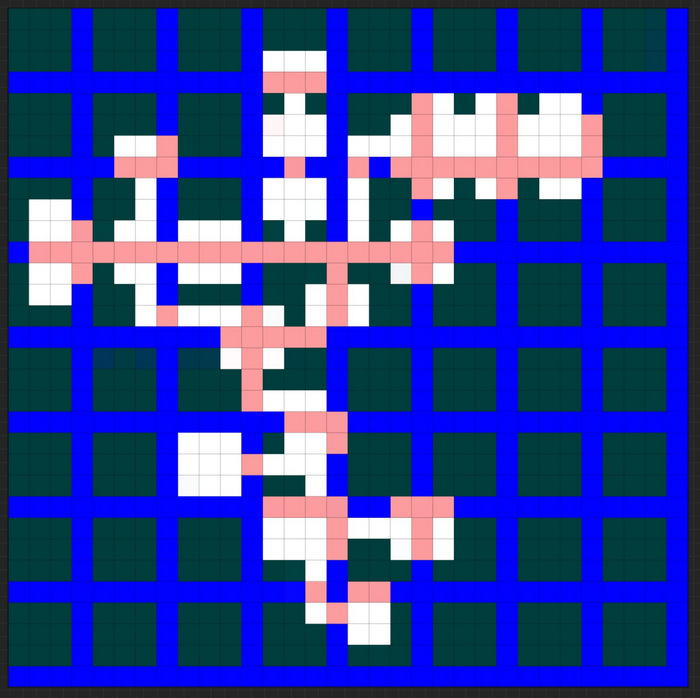

# map1 layout design
## about
* this is just for converting the map from image to bits

## image
* 

## raw bit values

```
1 1 1 1  1 1 1 1   1 1 1 1  1 1 1 1   1 1 1 1  1 1 1 1   1 1 1 1  1 1 1 1   
1 1 1 1  1 1 1 1   1 1 1 1  1 1 1 1   1 1 1 1  1 1 1 1   1 1 1 1  1 1 1 1   
1 1 1 1  1 1 1 1   1 1 1 1  1 1 1 1   1 1 1 1  1 1 1 1   1 1 1 1  1 1 1 1   
1 1 1 1  1 1 1 1   1 1 1 1  1 1 1 1   1 1 1 1  1 1 1 1   1 1 1 1  1 1 1 1   
                                                                            
1 1 1 1  1 1 1 1   1 1 1 1  1 1 1 1   1 1 1 1  1 1 1 1   1 1 1 1  1 1 1 1   
1 1 1 1  1 1 1 1   1 1 1 1  1 1 1 1   1 1 1 1  1 1 1 1   1 1 1 1  1 1 1 1   
1 1 1 1  1 1 1 1   1 1 1 1  1 1 1 1   1 1 1 1  1 1 1 1   1 1 1 1  1 1 1 1   
1 1 1 1  1 1 1 1   1 1 1 1  1 1 1 1   1 1 1 1  1 1 1 1   1 1 1 1  1 1 1 1   
                                                                            
1 1 1 1  1 1 1 1   1 1 1 1  1 1 1 1   1 1 1 1  1 1 1 1   1 1 1 1  1 1 1 1   
1 1 1 1  1 1 1 1   1 1 1 1  1 1 1 1   1 1 1 1  1 1 1 1   1 1 1 1  1 1 1 1   
1 1 1 1  1 1 1 1   1 1 1 1  1 1 1 1   1 1 1 1  1 1 1 1   1 1 1 1  1 1 1 1   
1 1 1 1  1 1 1 1   1 1 1 1  1 1 1 1   1 1 1 1  1 1 1 1   1 1 1 1  1 1 1 1   
                                                                            
1 1 1 1  1 1 1 1   1 1 1 1  1 1 1 1   1 1 1 1  1 1 1 1   1 1 1 1  1 1 1 1   
1 1 1 1  1 1 1 1   1 1 1 1  1 1 1 1   1 1 1 1  1 1 1 1   1 1 1 1  1 1 1 1   
1 1 1 1  1 1 1 1   1 1 1 1  1 1 1 1   1 1 1 1  1 1 1 1   1 1 1 1  1 1 1 1   
1 1 1 1  1 1 1 1   1 1 1 1  1 1 1 1   1 1 1 1  1 1 1 1   1 1 1 1  1 1 1 1   
                                                                            
1 1 1 1  1 1 1 1   1 1 1 1  1 1 1 1   1 1 1 1  1 1 1 1   1 1 1 1  1 1 1 1   
1 1 1 1  1 1 1 1   1 1 1 1  1 1 1 1   1 1 1 1  1 1 1 1   1 1 1 1  1 1 1 1   
1 1 1 1  1 1 1 1   1 1 1 1  1 1 1 1   1 1 1 1  1 1 1 1   1 1 1 1  1 1 1 1   
1 1 1 1  1 1 1 1   1 1 1 1  1 1 1 1   1 1 1 1  1 1 1 1   1 1 1 1  1 1 1 1   
                                                                            
1 1 1 1  1 1 1 1   1 1 1 1  1 1 1 1   1 1 1 1  1 1 1 1   1 1 1 1  1 1 1 1   
1 1 1 1  1 1 1 1   1 1 1 1  1 1 1 1   1 1 1 1  1 1 1 1   1 1 1 1  1 1 1 1   
1 1 1 1  1 1 1 1   1 1 1 1  1 1 1 1   1 1 1 1  1 1 1 1   1 1 1 1  1 1 1 1   
1 1 1 1  1 1 1 1   1 1 1 1  1 1 1 1   1 1 1 1  1 1 1 1   1 1 1 1  1 1 1 1   
                                                                            
1 1 1 1  1 1 1 1   1 1 1 1  1 1 1 1   1 1 1 1  1 1 1 1   1 1 1 1  1 1 1 1   
1 1 1 1  1 1 1 1   1 1 1 1  1 1 1 1   1 1 1 1  1 1 1 1   1 1 1 1  1 1 1 1   
1 1 1 1  1 1 1 1   1 1 1 1  1 1 1 1   1 1 1 1  1 1 1 1   1 1 1 1  1 1 1 1   
1 1 1 1  1 1 1 1   1 1 1 1  1 1 1 1   1 1 1 1  1 1 1 1   1 1 1 1  1 1 1 1   
                                                                            
1 1 1 1  1 1 1 1   1 1 1 1  1 1 1 1   1 1 1 1  1 1 1 1   1 1 1 1  1 1 1 1   
1 1 1 1  1 1 1 1   1 1 1 1  1 1 1 1   1 1 1 1  1 1 1 1   1 1 1 1  1 1 1 1   
1 1 1 1  1 1 1 1   1 1 1 1  1 1 1 1   1 1 1 1  1 1 1 1   1 1 1 1  1 1 1 1   
1 1 1 1  1 1 1 1   1 1 1 1  1 1 1 1   1 1 1 1  1 1 1 1   1 1 1 1  1 1 1 1   
                                                                            
```
