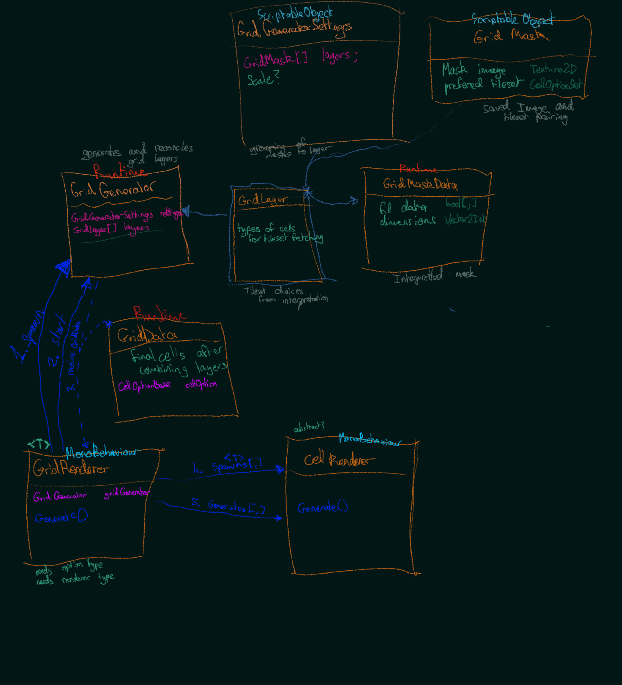

# tile mapping notes

## about
* this file will be for notes relating to tilemapping and generation of tiles

--- 

## plans and design

### notes

<!-- notes about the tile map design -->

### ideas

* `GridGenerator` -> `GridLayer`: should be that each cell in grid generator holds a linked list instead of the `O(L*M*N)` memory for this

### diagrams

#### 20250510 - suggested structure

* early pre-muliroom levels diagram to figure out how the tiles would work together

#### 20250515 - structure investigation
* diagram was made while investigating the way that objects were creating, initialising, and referencing each other
* notice the spaghetti

#### 20250516 - grid architecture design
* proposed new structure
* this structure is mostly to become more familiar with C# and experiment with performance
* this option will provide a lot of insight in to how unity handles object creation/deletion and give a solid foundation for improvement without as much work required

---
