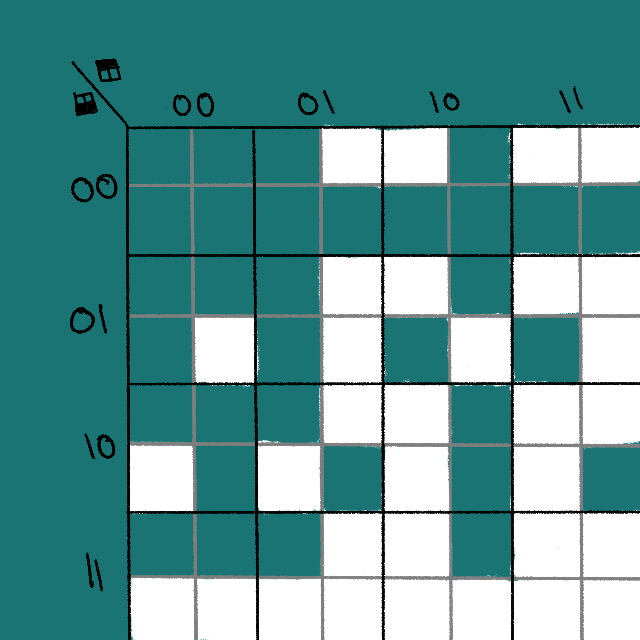

# tile mapping notes

## about
* this file will be for notes relating to tilemapping and generation of tiles

--- 

## plans and design

### notes

<!-- notes about the tile map design -->

### ideas

* `GridGenerator` -> `GridLayer`: should be that each cell in grid generator holds a linked list instead of the `O(L*M*N)` memory for this

### diagrams

#### 20250510 - suggested structure

* early pre-muliroom levels diagram to figure out how the tiles would work together

#### 20250515 - structure investigation
* diagram was made while investigating the way that objects were creating, initialising, and referencing each other
* notice the spaghetti

#### 20250516 - grid architecture design
* proposed new structure
* this structure is mostly to become more familiar with C# and experiment with performance
* this option will provide a lot of insight in to how unity handles object creation/deletion and give a solid foundation for improvement without as much work required

#### 20250517 - grid architecture design
* showing the tile map varieties and how a [dual grid system](https://youtu.be/jEWFSv3ivTg) would look
* currently seems we've reinvented the 47-piece system's wheel

|  |
| --- |
|  |
|  |

#### 20250517 - dual grid tile atlas and indexing

##### alternative ordering
* an experiment which helped to highlight how unfriendly it is to work with from an artist's perspective
* it might be useful instead to translate tilemaps (before use) into this style which would reduce processing overhead at the cost of memory overhead from more textures 

| binary ordering | grey code ordering |
| :---: | :---: |
|  |  |

##### tile quadrant usage

| tiles with topleft to bottomright row major ordering  | shown with values corresponding to quadrant being filled |
| :---: | :---: |
|  |  |

##### tile type karnaugh map

| tile values rearranged to grey code ordering | k-mapped tile indices with minterm labels |
| :---: | :---: |
|  |  |

| quadrant | sum of products |
| --- | --- |
| top left | `y = ((!A)(!C)(!D)) + (( B)(!C)(!D)) + ((!B)( C)( D)) + ((!A)( B)( D))` |
| top right | `y = ((!B)(!C)(!D)) + (( A)( B)(!D)) + ((!A)(!B)( D)) + (( B)( C)( D))` |
| bottom left | `y = ((!A)( B)(!D)) + ((!B)( C)(!D)) + (  (!A)( C)  ) + (( B)( C)( D))` |
| bottom right | `y = ((!A)(!B)(!D)) + (( A)( B)( D)) + (( A)(!B)(!D)) + (( B)( C)(!D))` |

---
